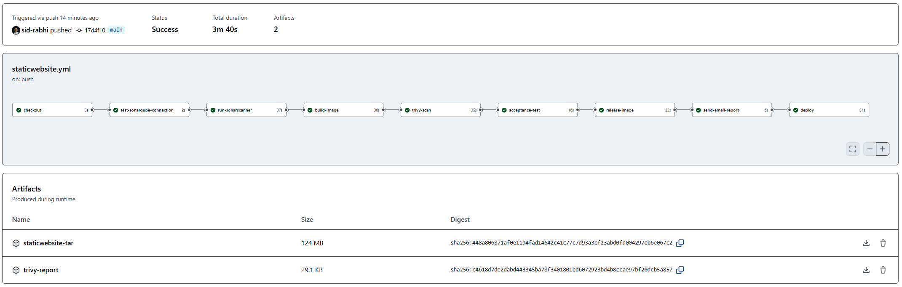
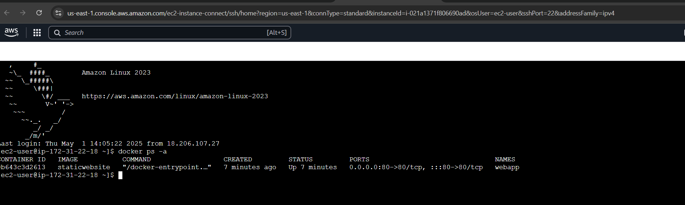
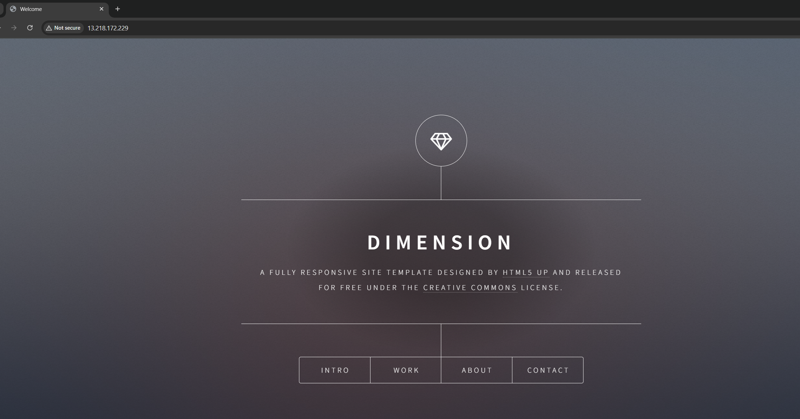

# Static Website CI/CD Pipeline

**Auteur**: Sid Ahmed Rabhi  
**Date**: 06 janvier 2024  
**LinkedIn**: [Sid Ahmed Rabhi](https://www.linkedin.com/in/sid-ahmed-rabhi/)  
**Portfolio**: [Sid Rabhi Portfolio](https://www.sid-rabhi.fr/)

---

## Aperçu du Pipeline CI/CD

---

## Workflow du Pipeline CI/CD avec Conditions d'Exécution

1. **Checkout Code**
   - *Condition*: S'exécute à chaque `push` ou `pull_request` sur la branche `main`.
   - Télécharge le code source depuis GitHub pour le traitement ultérieur.

2. **SonarQube Quality Scan**
   - *Condition*: S'exécute après le `checkout`.
   - Vérifie la connectivité avec le serveur **SonarQube** en utilisant `curl` pour garantir l'accessibilité du serveur avant de commencer l'analyse.
   - Lance ensuite l'**analyse SonarQube** avec **SonarQube Scanner** pour détecter les bugs, vulnérabilités et mauvaises pratiques dans le projet.
   - Les résultats de l'analyse de qualité du code sont envoyés à **SonarQube** pour un rapport détaillé.

3. **Build Docker Image**
   - *Condition*: S'exécute après l'analyse SonarQube.
   - Construit une image Docker à partir du `Dockerfile` et la sauvegarde sous le nom `staticwebsite.tar`.
   - Cette image sera utilisée pour tester et déployer l'application dans les environnements suivants.

4. **Trivy Scan**
   - *Condition*: S'exécute après la construction de l'image Docker.
   - Effectue une analyse de sécurité de l'image Docker à l'aide de **Trivy**.
   - Les résultats de l'analyse des vulnérabilités sont stockés dans un fichier JSON `trivy-report.json` et téléchargés en tant qu'artefact.

5. **Acceptance Test**
   - *Condition*: S'exécute après l'analyse Trivy.
   - Lance un conteneur Docker à partir de l'image construite pour effectuer un test d'acceptation en effectuant un `curl` sur l'application déployée.

6. **Release Image**
   - *Condition*: S'exécute après le test d'acceptation.
   - Se connecte au registre GitHub Container Registry et pousse l'image Docker avec le tag du commit (`$GITHUB_SHA`), pour garder une trace des versions.

7. **Send Email Report**
   - *Condition*: S'exécute après la publication de l'image.
   - Envoie un rapport des vulnérabilités détectées par Trivy à l'adresse email spécifiée. Le rapport est attaché sous forme de fichier JSON.

8. **Deploy to EC2**
   - *Condition*: S'exécute après l'envoi du rapport par email.
   - Utilise **SCP** pour copier l'image Docker sur une instance EC2.
   - Déploie l'application sur EC2 en arrêtant et en supprimant les anciens conteneurs, puis en chargeant et exécutant le nouveau conteneur avec l'image Docker mise à jour.

---

## Aperçu des Environnements

L'application est déployée dans un environnement de production sur une instance **EC2** après avoir été testée, analysée pour les vulnérabilités, et validée par des tests d'acceptation.

---

## Aperçu du Site

---

## Technologies Utilisées

- **Docker**: Utilisé pour encapsuler l'application dans des conteneurs afin de simplifier le processus de déploiement.
- **GitHub Actions CI/CD**: Automatisation des processus de création, de test, et de déploiement.
- **SonarQube**: Analyse de la qualité du code pour détecter les vulnérabilités, les bugs et les mauvaises pratiques.
- **Trivy**: Outil d'analyse de sécurité des images Docker pour détecter les vulnérabilités critiques.
- **GitHub Container Registry**: Stockage des images Docker pour les versions de l'application.
- **SCP & SSH**: Utilisés pour transférer et déployer l'image Docker sur EC2.
- **Email Notification**: Envoi de rapports de vulnérabilités par email après l'analyse Trivy.

---

## Conclusion

Avec l'intégration de **SonarQube** pour la qualité du code, **Trivy** pour l'analyse de sécurité et **Docker** pour la conteneurisation, ce pipeline CI/CD offre un processus complet pour la création, le test, la validation et le déploiement de l'application. L'automatisation de ces étapes assure que l'application est prête pour la production de manière fiable et sécurisée.

---

